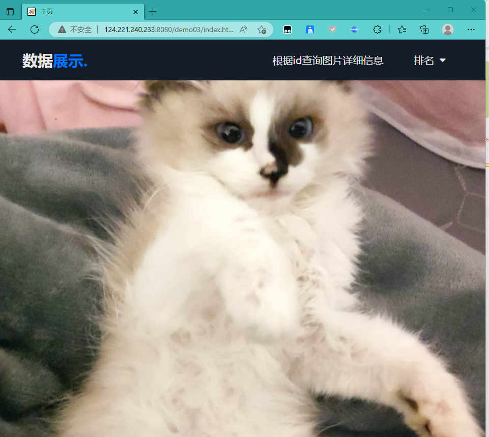

# 项目简介

本项目爬取zcool网站主页上*首页推荐*的图片，并进行查询，展示，排序功能的实现

**<u>已开源至github</u>**

**<u>仓库网址：</u>**https://github.com/cfxxxx/zcool

# 项目开发人员

**陈喆，程柯嘉，朱沛杰，武英杰**

# 技术栈

### 数据库

- mysql
  - 使用Druid数据库连接池，使网站在高并发访问的情况下依旧能保持一定的稳定性
- redis

### 前端

- html+css+JavaScript
- 动态渲染选择了==thymeleaf框架==

### 后端

- 使用原生javaweb开发
- 出于性能和项目体量考虑，并没有选择使用ssm框架
- 手写==mvc三层架构==
- ==多线程异步爬虫==

# 开发流程

- [ ] python爬虫爬取前100页图片相关数据，以json串形式存储
- [ ] 数据库建表，对爬取的数据清洗后，将数据存储到mysql数据库中
- [ ] 对表结构进行优化，建立索引
- [ ] 前后端开发，实现简单的查询展示功能
- [ ] 因为性能问题开始尝试使用redis消息中间件，==大幅度提高了性能==，降低了响应时间
- [ ] 完善前后端，实现成品

# 爬虫简介

以下是原始爬虫代码

原本爬虫代码是写了两份，一份用来爬文本信息，一份用来爬图片的二进制字节流，后来应数据库优化人员的要求，==合并成了一份爬虫==，并把爬取==图片二进制字节流改为爬取图片的url==，以节省空间

```python
if __name__ == '__main__':
    #url = 'https://www.zcool.com.cn/?p=1&action=zcool_index_old#tab_anchor'
    headers = {'User-Agent': 'Mozilla/5.0 (Windows NT 10.0; Win64; x64) AppleWebKit/537.36 (KHTML, like Gecko) Chrome/103.0.5060.53 Safari/537.36 Edg/103.0.1264.37'}
    if not os.path.exists('./picUrls'):
        os.mkdir('./picUrls')

    for i in range(1, 101):
        url = 'https://www.zcool.com.cn/?p=' + str(i) + '&action=zcool_index_old#tab_anchor'
        response = requests.get(url, headers=headers)
        #response.encoding = 'utf-8'
        page_text = response.text

        tree = etree.HTML(page_text)
        div_list = tree.xpath('//div[@class="sc-hKwDye jgyXZm workList"]/div[@class="sc-vkzd68-0 iGoLzH cardBox contentCardBox"]')

        

        for div in div_list:
            dict = {}
            img_src = div.xpath('./div[@class="cardImg"]/a/img/@src')[0]
            img_name = div.xpath('./div[@class="cardImg"]/a/img/@alt')[0]+'.jpg'
            img_name = re.sub(r'[:/\\?*鈥溾�?�?<>|]', '_', img_name)

            
            pic_theme = div.xpath('./section[@class="sc-jqn0up-2 oaRTx cardInfo"]/span[@class="sc-jqn0up-3 bUdQUi cardType"]/text()')[0]

            pic_view = div.xpath('./section[@class="sc-jqn0up-2 oaRTx cardInfo"]/div[@class="sc-hKwDye eESxKY cardIcons"]/div[1]//span/text()')[0]
            pic_common = div.xpath('./section[@class="sc-jqn0up-2 oaRTx cardInfo"]/div[@class="sc-hKwDye eESxKY cardIcons"]/div[2]//span/text()')[0]

            pic_good = div.xpath('./section[@class="sc-jqn0up-2 oaRTx cardInfo"]/div[@class="sc-hKwDye eESxKY cardIcons"]/div[3]//span/text()')[0]

            dict["img_name"] = img_name
            dict["theme"] = pic_theme
            dict["view"] = pic_view
            dict["common"] = pic_common
            dict["good"] = pic_good
            dict["img_src"] = img_src
            
            info_json = json.dumps(dict)
            info_json = info_json.encode('utf-8').decode()

            f = open('picUrls/infoUrl.txt','a',encoding='utf-8')
            f.write(info_json)
```

<br/>

后期我们将爬虫代码部署到云服务器，实现了多线程异步爬虫，以下是代码：

```python
import datetime
import threading
import time
import requests
from apscheduler.schedulers.background import BackgroundScheduler
from lxml import etree
import re
import redis
from concurrent.futures import ThreadPoolExecutor


# 多线程定时爬虫，每个爬虫分管一部分页面，每个爬虫每次要完成多个任务（六种缓存）
# 10个爬虫分管1~1000页的图片爬取，每隔一小时进行一次爬取任务，对缓存数据动态更新
# redis缓存按评论量、浏览量、点赞量和综合热度为图片名称建立索引，将图片的所信息按
# 主题分类存放
# 不考虑使用持久化数据库，由于在爬虫一直工作，使用缓存足够


def verifyChar(str_):
    flag = " " in str_
    if flag:
        return False
    return "<" in str_ or ">" in str_ or "/" in str_ or "?" in str_ or "》" in str_ \
           or "《" in str_ or "。" in str_ or "，" in str_ or "." in str_ or "," in str_ \
           or ";" in str_ or "]" in str_ or "[" in str_ or "}" in str_ or "{" in str_ or "】" in str_ or "【" in str_ \
           or "）" in str_ or "(" in str_ or ")" in str_ or "_" in str_ or "—" in str_ \
           or "（" in str_ or "*" in str_ or "&" in str_ or "^" in str_ or "%" in str_ or "$" in str_ or "#" in str_ \
           or "`" in str_ or "~" in str_ or "=" in str_ or "+" in str_ or "！" in str_ or "!" in str_ or "@" in str_ \
           or "'" in str_ or '"' in str_ or ":" in str_ or "0" in str_ or "1" in str_ or "2" in str_ or "3" in str_ \
           or "4" in str_ or "5" in str_ or "6" in str_ or "7" in str_ or "8" in str_ or "9" in str_


class Crawler(threading.Thread):

    def __init__(self, startPage, endPage, redis__, member_, log) -> None:
        super().__init__()
        # 确保没有漏爬
        if startPage > 1:
            startPage -= 1
        self.startPage = startPage
        self.endPage = endPage
        self.redis__ = redis__
        self.member_ = member_
        self.log = log

    def run(self) -> None:
        super().run()
        # print("{}号爬虫开始执行任务".format(self.member_))
        self.log.write("{}号爬虫开始执行任务\n".format(self.member_))
        for i in range(self.startPage, self.endPage):
            # 以下为爬虫任务
            url = 'https://www.zcool.com.cn/?p=' + str(i) + '&action=zcool_index_old#tab_anchor'
            response = requests.get(url, headers=headers)
            page_text = response.text
            tree = etree.HTML(page_text)
            div_list = tree.xpath(
                '//div[@class="sc-hKwDye jgyXZm workList"]/div[@class="sc-vkzd68-0 iGoLzH'
                ' cardBox contentCardBox"]')
            for div in div_list:
                # print("当前正在爬取第 {} 张页面".format(i))
                self.log.write("当前 {} 号爬虫正在爬取第 {} 张页面\n".format(self.member_, i))
                dict = {}
                img_src = div.xpath('./div[@class="cardImg"]/a/img/@src')[0]
                img_name = div.xpath('./div[@class="cardImg"]/a/img/@alt')[0] + '.jpg'
                img_name = re.sub(r'[:/\\?*閳ユ壕鈧 锟 <>|
		]', '_', img_name)
                img_theme = div.xpath(
                    './section[@class="sc-jqn0up-2 oaRTx cardInfo"]/span[@class="sc-jqn0up-3 '
                    'bUdQUi cardType"]/text()')[0]
                img_view = div.xpath(
                    './section[@class="sc-jqn0up-2 oaRTx cardInfo"]/div[@class="sc-hKwDye eESxKY '
                    'cardIcons"]/div[1]//span/text()')[
                    0]
                img_common = div.xpath(
                    './section[@class="sc-jqn0up-2 oaRTx cardInfo"]/div[@class="sc-hKwDye eESxKY'
                    ' cardIcons"]/div[2]//span/text()')[
                    0]
                img_good = div.xpath(
                    './section[@class="sc-jqn0up-2 oaRTx cardInfo"]/div[@class="sc-hKwDye eESxKY '
                    'cardIcons"]/div[3]//span/text()')[
                    0]
                # 判断字符编码
                if u'\u4e00' <= img_name[-10: -4] <= u'\u9fff' or img_name[-10: -4].isalpha() or verifyChar(
                        img_name[-10: -4]):
                    # 判断为干净数据
                    dirName = "dataClassByTheme:"
                    keyView = "indexSortByView"
                    keyCommon = "indexSortByCommon"
                    keyGood = "indexSortByGood"
                    keyDegree = "indexSortByDegree"
                else:
                    # 判断为废弃数据（另存，需进一步清洗）
                    dirName = "discardDataClassByTheme:"
                    keyView = "discardIndexSortByView"
                    keyCommon = "discardIndexSortByCommon"
                    keyGood = "discardIndexSortByGood"
                    keyDegree = "discardIndexSortByDegree"
                # 以下为Redis缓存操作
                # 直接存入redis
                self.redis__.select(1)
                if img_view.endswith("w"):
                    img_view = img_view.replace("w", "")
                    img_view = int(float(img_view) * 10000)
                else:
                    img_view = int(img_view)
                if img_common.endswith("w"):
                    img_common = img_common.replace("w", "")
                    img_common = int(float(img_common) * 10000)
                else:
                    img_common = int(img_common)
                if img_good.endswith("w"):
                    img_good = img_good.replace("w", "")
                    img_good = int(float(img_good) * 10000)
                else:
                    img_good = int(img_good)
                # 计算热度（测试）先随便按权重
                img_degree = round(img_view / 10000 + img_good / 100 + img_common / 1000, 2)
                dict["img_name"] = img_name
                dict["theme"] = img_theme
                dict["degree"] = img_degree
                dict["view"] = img_view
                dict["common"] = img_common
                dict["good"] = img_good
                dict["img_src"] = img_src

                # 按图片分类存储
                self.redis__.hmset(dirName + img_theme + ":" + img_name, dict)
                # 按浏览、点赞、评论量存储(倒序)
                # 以下所有值的格式是为按主题和图片名称查询服务的
                # 完成了根据浏览量排名的实时更新
                # 注意排名是倒序的！应从后往前取
                # redis__.select(1)
                # 按浏览量存储

                valueView = {img_theme + ":" + img_name: int(img_view)}
                self.redis__.zadd(keyView, valueView)
                # 按评论数存储

                valueCommon = {img_theme + ":" + img_name: int(img_common)}
                self.redis__.zadd(keyCommon, valueCommon)
                # 按点赞数存储

                valueGood = {img_theme + ":" + img_name: int(img_good)}
                self.redis__.zadd(keyGood, valueGood)
                # 按热度存储

                valueDegree = {img_theme + ":" + img_name: img_degree}
                self.redis__.zadd(keyDegree, valueDegree)
        print("爬取完毕")


def timingTask():
    # 重启资源
    redis_ = redis.Redis(host='1*1', port=*, password='*')
    threadPool = ThreadPoolExecutor(max_workers=crawlerCount)
    connPool = redis.ConnectionPool(host='***.***.***.***', port=****, password='****', max_connections=10)
    startTime = datetime.datetime.now()
    crawlers = []
    conns = []
    log = open("./log.txt", "a")
    log1 = open("./log1.txt", "a")
    global crawlerId
    for i in range(start, end, step):
        crawlerId += 1
        startPage_ = i
        endPage_ = i + step
        # 每个爬虫线程各用一条连接
        # redis_ = redis.Redis(connection_pool=connPool)
        # conns.append(redis_)
        crawlers.append(Crawler(startPage_, endPage_, redis_, crawlerId, log1))
    for c in crawlers:
        c.start()
    for c in crawlers:
        c.join()
    # 下面为单线程爬虫测试
    # redis_ = redis.Redis(connection_pool=connPool)
    # Crawler(1, 10, redis_, crawlerId).run()
    # 本次任务结束后，释放资源
    endTime = datetime.datetime.now()
    lastTime = endTime - startTime
    log.write("本次任务开始时间为： {}，结束时间为： {}，爬取了 {} 个页面，耗时: {}\n"
              .format(startTime, endTime, end - start, lastTime))
    log1.write("本次任务开始时间为： {}，结束时间为： {}，爬取了 {} 个页面，耗时: {}\n"
              .format(startTime, endTime, end - start, lastTime))
    # log.write("下次任务将在 {} 后开始。。。".format())
    log.close()
    log1.close()
    threadPool.shutdown()
    # for conn in conns:
    #     connPool.release(conn)
    redis_.close()


def dataPersistence():
    pass


# 全局常量配置
# url = 'https://www.zcool.com.cn/?p=1&action=zcool_index_old#tab_anchor'
headers = {
    'User-Agent': 'Mozilla/5.0 (Windows NT 10.0; Win64; x64) AppleWebKit/537.36 (KHTML, like Gecko) '
                  'Chrome/103.0.5060.53 Safari/537.36 Edg/103.0.1264.37'}
crawlerCount = 10  # 爬虫数量/子线程数量
start = 1  # 开始页面
end = 500  # 结束页面
step = int((end - start) / crawlerCount)  # 步长
if step < 1:
    step = 1
crawlerId = 0
interval = 3600


def main():
    # 进行首次执行
    timingTask()
    scheduler = BackgroundScheduler()
    scheduler.add_job(timingTask, 'interval', seconds=interval)
    scheduler.start()
    while True:
        time.sleep(120)


if __name__ == '__main__':
    main()

```

# 前后端简介

前后端开发是==分阶段进行==的，从一个小的demo到不断的完善功能，debug，最后形成最终的版本

接下来介绍开发过程中最重要的==五个版本==

值得注意的是，五个版本已经全部部署到云，访问地址我会放在下面：

- [124.221.240.233:8080/demo01/index.html](https://)
- [124.221.240.233:8080/demo03/index.html](https://)
- [124.221.240.233:8080/demo05/index.html](https://)
- [124.221.240.233:8080/zcool/picture.do](https://)
- [124.221.240.233:8080/zcool_final/picture.do](https://)

## 版本一

### 网址

[124.221.240.233:8080/demo01/index.html](https://)

### 项目内容

demo01是为了测试java后端程序能不能正常和mysql数据库进行交互，于是写了一个小的测试案例，完成了==POJO层，DAO层，和Service层==的搭建，实现了根据id进行简单的图片信息查询功能

### 部分项目代码

```java
@WebServlet("/lable.do")
public class LableServlet extends ViewBaseServlet {
    @Override
    protected void service(HttpServletRequest req, HttpServletResponse resp) throws ServletException, IOException {
        System.out.println("收到请求");
        req.setCharacterEncoding("utf-8");
        LableService lableService = new LableService();
        HttpSession session = req.getSession();
        
        String idStr = req.getParameter("id");
        int id = Integer.parseInt(idStr);

        Lable lable = lableService.getLableById(id);
        session.setAttribute("lable", lable);
        super.processTemplate("index", req, resp);
    }
}
```

### 项目截图


### 存在问题

后端应用程序的项目==架构十分粗糙==，只是一个简单的查询，完全没有考虑代码的健壮性，并且前端页面十分简陋

## 版本二

### 网址

[124.221.240.233:8080/demo03/index.html](https://)

### 项目内容

完善了部分前端代码，增加了css样式表和js代码，增加了一个首页，增加了按照图片的==观看量，点赞量，或者综合热度==进行排名

### 部分项目代码

```java
@WebServlet("/lable.do")
public class PictureServlet extends ViewBaseServlet{
    @Override
    protected void service(HttpServletRequest req, HttpServletResponse resp) throws ServletException, IOException {
        req.setCharacterEncoding("utf-8");
        String operate = req.getParameter("operate");

        if (StringUtil.isEmpty(operate)) {
            operate = "index";
        }

        switch (operate) {
            case "index":
                index(req, resp);
                break;
            case "search":
                search(req, resp);
                break;
            case "view":
                view(req, resp);
                break;
            case "good":
                good(req, resp);
                break;
            case "degree":
                degree(req, resp);
                break;
            case "picture":
                picture(req, resp);
                break;
            default:
                throw new RuntimeException("operate值非法");
        }
    }

    public void index(HttpServletRequest req, HttpServletResponse resp) throws IOException {
        LableService lableService = new LableService();
        HttpSession session = req.getSession();
        super.processTemplate("index", req, resp);
    }

    public void search(HttpServletRequest req, HttpServletResponse resp) throws IOException {
        LableService lableService = new LableService();
        HttpSession session = req.getSession();

        String idStr = req.getParameter("id");
        int id = 2991;
        if (idStr != null) {
            id = Integer.parseInt(idStr);
        }

        Lable lable = lableService.getLableById(id);
        session.setAttribute("lable", lable);
        super.processTemplate("search", req, resp);
    }

    public void view(HttpServletRequest req, HttpServletResponse response) throws IOException {
        LableService lableService = new LableService();
        HttpSession session = req.getSession();

        long l = System.currentTimeMillis();
        List<Lable> lables = lableService.orderByView();
        long l1 = System.currentTimeMillis();
        System.out.println(l1-l);
        session.setAttribute("lables", lables);
        super.processTemplate("order", req, response);

    }

    public void good(HttpServletRequest req, HttpServletResponse resp) throws IOException {
        LableService lableService = new LableService();
        HttpSession session = req.getSession();

        List<Lable> lables = lableService.orderByGood();
        session.setAttribute("lables", lables);
        super.processTemplate("order", req, resp);
    }

    public void degree(HttpServletRequest req, HttpServletResponse resp) throws IOException {
        LableService lableService = new LableService();
        HttpSession session = req.getSession();

        List<Lable> lables = lableService.orderByDegree();
        session.setAttribute("lables", lables);
        super.processTemplate("order", req, resp);
    }

    public void picture(HttpServletRequest req, HttpServletResponse resp) throws IOException {
        resp.sendRedirect(req.getParameter("src"));
    }
}
```

### 项目截图



### 存在问题

本来想尝试把 “根据id查询图片” 改成 “根据图片名称查询图片” ，但是在执行sql语句 “select * from data02 where name = xxx” 的时候，==查询出来的结果始终为null==，初步猜测可能是==编码问题==，但经过各种方式的尝试依旧不能解决。

在根据浏览量，点赞量，综合热度进行排名时，不知道是什么原因，==响应时间较长（5到6秒左右）==。通过debug发现，当在本机启动tomcat程序时，是在执行 "select * from data02 order by view limit 10" 等类似sql语句时，需要花费的时间是5663ms。

## 版本三

### 网址

[124.221.240.233:8080/demo05/index.html](https://)

### 项目内容

出于对上个版本==无法按照图片名称查询==和==select语句执行速度较慢==的问题的考量，我们引入了redis消息中间件，抛弃了mysql数据库和DAO层，修复了了不能根据带有中文的字段查询图片的bug，增加了根据主题查询图片（显示该主题下的所有图片，但必须要输入精确的图片主题），原有的排序功能不变的基础下，增加了爬虫爬取数据的数量，从==mysql中原本3500条数据的数据量增大到redis中35000的数据量==，通过debug发现，当对redis进行查询时，只需要花费100ms，综合速度相较于mysql大约提升了==600倍==（数据量大了10倍，查询速度快了60倍）

### 部分项目代码（只展示更新的redis部分）

```java
public class Redis {
    public Jedis js = new Jedis("124.223.167.161", 6379);

    public Redis() {
        js.auth("021112Cz");
        js.connect();
    }
    public String hget(String key, String field) {
        return js.hget(key, field);
    }

    public Set<String> themeKeys(String theme) {
        return js.keys("dataClassByTheme:" + theme + "*");
    }

    public Set<String> nameKeys(String name) {
        return js.keys("dataClassByTheme:*:*" + name + "*");
    }


    public List<String> hmget(String key, String... fields) {
        return js.hmget(key, fields);
    }

    public Set<String> zrange(String key, int start, int end) {
        return js.zrange(key, start, end);
    }
}

```

### 项目截图


### 存在问题

项目==整体结构不清晰==，前端界面不够美观，根据主题查询图片时只有输入==准确的主题名==才能查找到主题下的所有图片，但问题是用户并不知道主题有哪些，并且当一个主题下的图片过多时，前端页面动态渲染会将表头挤出屏幕外。

## 版本四

### 网址

[124.221.240.233:8080/zcool/picture.do](https://)

### 项目内容

优化了项目结构，手写了==mvc三层架构==，完善了Dispatcher层，Controller层和Service层，通过解析xml配置文件，反射调用相关方法，降低了类与类的==耦合度==，相较于以前实现了==高内聚==，在首页展示热度排名前六高的图片，并可以查看其详细信息，增加了==按图片名称模糊查找==的功能。

### 部分项目代码

```java
@Override
    protected void service(HttpServletRequest req, HttpServletResponse resp) throws ServletException, IOException {
        //设置编码
        req.setCharacterEncoding("utf-8");

        String servletPath = req.getServletPath();
        servletPath = servletPath.substring(1);
        int lastDotIndex = servletPath.lastIndexOf(".do");
        servletPath = servletPath.substring(0,lastDotIndex);

        Object controllerBeanObj = beanMap.get(servletPath);

        String operate = req.getParameter("operate");

        if (StringUtil.isEmpty(operate)) {
            operate = "index";
        }

        try {
            Method method = controllerBeanObj.getClass().getDeclaredMethod(operate, HttpServletRequest.class, HttpServletResponse.class);
            if (method != null) {
                method.setAccessible(true);
                method.invoke(controllerBeanObj, req, resp);
            }else {
                throw new RuntimeException("operate值非法");
            }
        } catch (NoSuchMethodException | IllegalAccessException | InvocationTargetException e) {
            throw new RuntimeException(e);
        }
    }
```

### 项目截图


### 存在问题

根据主题查询还是同样的问题，没有进行改进，并且发现排序时，展示出来的数据是正序排列（应为倒序排列），界面不够美观，当查询出的结果集过大时，会造成table表单挤出页面外的情况

## 版本五（最终版）

### 网址

[124.221.240.233:8080/zcool——final/picture.do](https://)

### 项目内容

极大优化了前端界面，修复了上个版本存在的所有问题，固定了table表格的大小，为table表格加入了滚动条，这样就不会挤出屏幕外。根据主题查询相关图片改为==让用户自己选择主题==，选择主题后会展示这个主题下所有的图片，优化用户体验

### 部分项目代码

```html
<body>
        <ul>
            <li th:unless="${#lists.isEmpty(session.lables)}" th:each="lable:${session.lables}"><a th:text="${lable.theme}" th:onclick="searchInfo([[${lable.theme}]])"></a></li>
        </ul>
    </body>
```

### 项目截图


### 存在问题

希望以后加入用户注册和登录功能

<br/>

# 数据库简介

## MySql

数据库结构展示


## Redis

数据库目录展示

